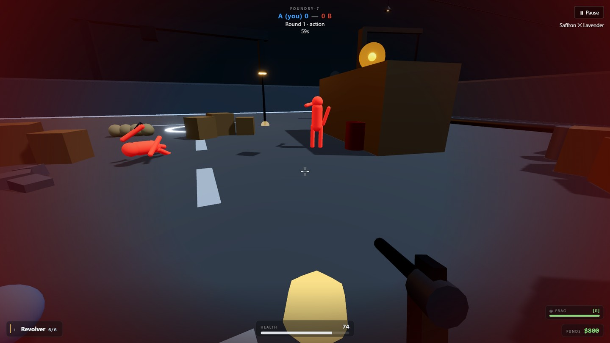
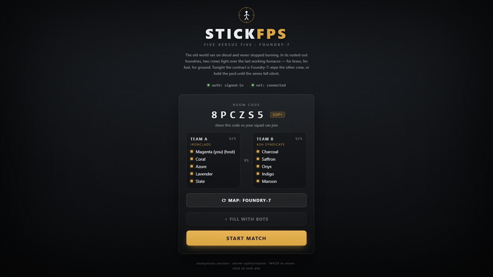
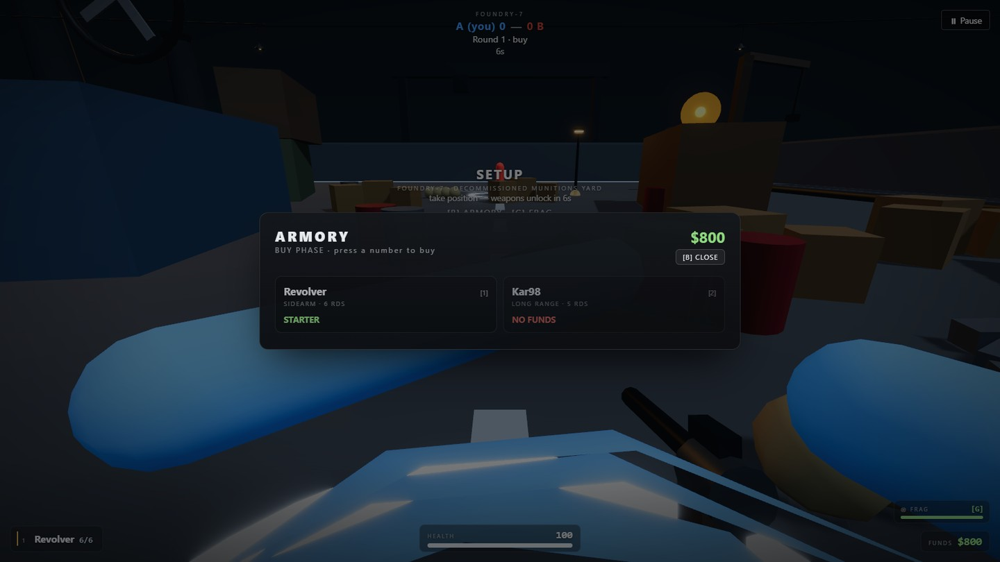
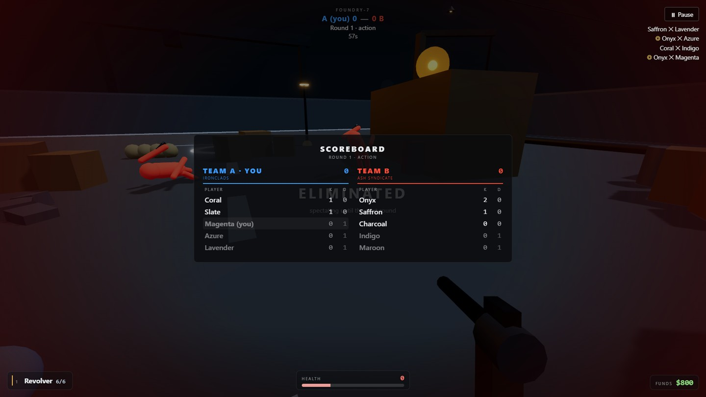
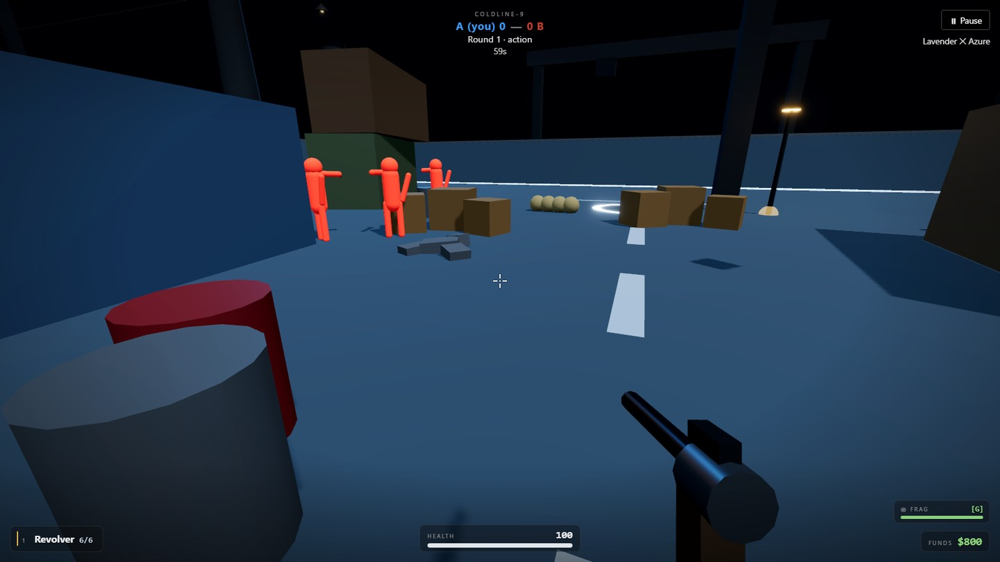

# Stickfps

A 5v5 round-based tactical shooter in the browser. Full-colour, low-poly stickman avatars,
Revolver + Kar98 + a frag grenade, killstreak perks, server-authoritative hit registration,
AI bots to fill a match, two cosmetic maps, ephemeral 6-character room codes. No accounts beyond
anonymous auth, no PII.

**Status:** all 8 build phases complete (spec through deploy config), plus ten post-launch follow-up rounds (audits, gameplay/feel expansion, fast-pace redesign, then a full-colour + bots + killstreak-perks + second-map + grenade upgrade) — see [PROGRESS.md](PROGRESS.md).



<sub>_A real match, captured live: a 5v5 round on FOUNDRY-7 with the roster filled by bots. Everything below is the actual client driven end-to-end — lobby, buy phase, combat, scoreboard._</sub>

## Screenshots

<table>
  <tr>
    <td width="50%" valign="top">
      
      <br><sub><b>Lobby.</b> Ephemeral 6-character room code, two crews (Ironclads vs Ash Syndicate), host-cyclable map, and a one-click <i>fill with bots</i> so a solo host can start a full 5v5.</sub>
    </td>
    <td width="50%" valign="top">
      
      <br><sub><b>Buy phase.</b> The armory opens for 8 seconds each round. The Revolver is free; the Kar98 unlocks once you can afford it — the purchase is validated server-side, not trusted from the client.</sub>
    </td>
  </tr>
  <tr>
    <td width="50%" valign="top">
      
      <br><sub><b>Scoreboard.</b> Hold <kbd>Tab</kbd> for the live board — per-player kills/deaths and round wins, sorted and self-highlighted. The kill feed and K/D here are driven by real bot-vs-bot combat.</sub>
    </td>
    <td width="50%" valign="top">
      
      <br><sub><b>Second map — COLDLINE-9.</b> The same server-authoritative ±24m arena, re-lit cold and blue. Maps are cosmetic themes over one shared sim, so variety never forks the authoritative world.</sub>
    </td>
  </tr>
</table>

## Stack

| | |
|---|---|
| Rendering | Three.js via React Three Fiber, Vite + React + TypeScript |
| Networking | WebSocket-over-TCP (`ws`), client-server only — no UDP, so the server runs on free no-card hosts |
| Auth | Supabase anonymous sign-in |
| Hosting | Frontend → Vercel, backend → any persistent Node host (Render/Koyeb free tier, or Fly.io); see [docs/DEPLOYMENT.md](docs/DEPLOYMENT.md) |

## Quick start

```bash
cd server && npm install && cp .env.example .env && npm run dev
cd client && npm install && cp .env.example .env && npm run dev   # in a second terminal
```

Open `http://localhost:5173` in two browser windows to test a match. Full walkthrough,
troubleshooting, and env var reference: **[docs/RUNNING.md](docs/RUNNING.md)**.

## Documentation

| Doc | What's in it |
|---|---|
| [PROJECT.md](PROJECT.md) | Product brief — pillars, match structure, repo layout |
| [docs/SRS.md](docs/SRS.md) | Full Software Requirements Specification — functional/non-functional requirements, architecture/sequence/state diagrams, data schemas, requirements traceability |
| [docs/RUNNING.md](docs/RUNNING.md) | How to run it locally, env vars, troubleshooting |
| [docs/DOCKER.md](docs/DOCKER.md) | Run the server in Docker locally, before touching the cloud |
| [docs/SUPABASE.md](docs/SUPABASE.md) | Run a full local Supabase stack (Postgres/Auth/Studio) via the CLI + Docker — no cloud account needed for dev |
| [docs/TESTING.md](docs/TESTING.md) | Automated test coverage map (vitest + Playwright browser E2E) + manual QA checklist |
| [docs/DEPLOYMENT.md](docs/DEPLOYMENT.md) | Vercel + Fly.io + Supabase deploy runbook |
| [docs/security-audit-phase7.md](docs/security-audit-phase7.md) | Server-authority audit — what was checked, how, and one real vulnerability found and fixed |
| [docs/CONTRIBUTING.md](docs/CONTRIBUTING.md) | The architect → coder → tester build process and codebase conventions |
| [TASKS.md](TASKS.md) / [PROGRESS.md](PROGRESS.md) | Phase-by-phase build checklist and running log |
| [docs/specs/](docs/specs/) | Per-task implementation specs (files, interfaces, acceptance criteria) |

## Repo layout

```
/client            Vite + React + TS + R3F frontend  (deploys to Vercel)
/server            WebSocket game server              (deploys to Render/Koyeb/Fly.io)
/docs              SRS, diagrams (inline Mermaid in SRS.md), specs, guides
/assets            README screenshots (real captures of the running game)
/.tooling/agents     architect / coder / tester subagent definitions
/.tooling/commands   /game-loop orchestration command
```

## Testing

```bash
cd server && npm test && npm run build
cd client && npm test && npm run build

# Real two-browser lobby E2E (Playwright) — see docs/TESTING.md for setup:
cd client && npm run test:e2e
```

52 client / 108 server unit tests, plus a Playwright suite that drives two real browser contexts through
room create/join over a real WebSocket connection. See [docs/TESTING.md](docs/TESTING.md) for full
coverage and the manual QA checklist for what's still human-only (movement feel, round timing) —
and [PROGRESS.md](PROGRESS.md)'s Follow-ups for the honest list of remaining gaps.
