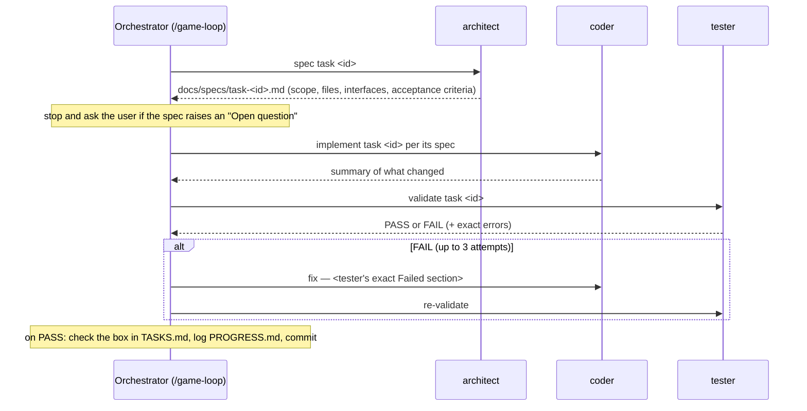

# Contributing / build process

This repo uses a three-role split for adding new work, backed by AI coding subagents in
`.tooling/agents/` and the orchestrating command in `.tooling/commands/game-loop.md`:

- **architect** (`.tooling/agents/architect.md`) turns one `TASKS.md` line into a spec — files to
  touch, exact interfaces, acceptance criteria. Never touches `/client/src` or `/server/src`.
- **coder** (`.tooling/agents/coder.md`) implements exactly one spec. Doesn't invent scope; notes
  anything else it notices under PROGRESS.md's Follow-ups instead of fixing it inline.
- **tester** (`.tooling/agents/tester.md`) runs builds/tests and checks acceptance criteria one by
  one. Read-only — reports PASS/FAIL, never edits code.
- **`/game-loop`** (`.tooling/commands/game-loop.md`) drives the loop above over whatever's unchecked
  in `TASKS.md`, top to bottom, unless you point it at a specific task id or phase.

## Adding a new task

Add a line under the relevant phase (or a new phase) in [TASKS.md](../TASKS.md) — tasks are
intentionally coarse; the architect step breaks each into the precise spec. Then run `/game-loop`
(or work through the same spec → implement → verify sequence yourself).

## Conventions this codebase already follows — keep them

- **Server authority (C1)**: nothing under `client/src` computes a hit, damage value, or
  authoritative position. If you're tempted to add one, it belongs in `server/src/rooms/Room.ts` or
  `server/src/combat/`, and the client should only ever render what the server broadcasts.
- **No client-server code sharing (yet)**: `client/src/net/messages.ts` and
  `server/src/net/messages.ts` are deliberately separate copies (see PROGRESS.md follow-ups) —
  update both together, and note the duplication in the PR/commit if you touch either.
- **Fixed timestep**: simulation logic runs at a fixed 60Hz step, independent of render/network
  jitter (`client/src/game/loop/useFixedTimestep.ts`, `server/src/sim/fixedInterval.ts`). Don't
  hang gameplay logic off `useFrame`'s raw delta or a raw `setInterval` elsewhere.
- **Object pooling for hot-path visuals**: bullets/particles/remote-player meshes are pre-allocated
  and toggled via `.visible`, never mounted/unmounted per event — see
  `client/src/game/pooling/ObjectPool.ts` and its usages.
- **Spec before code**: every phase in this repo has a `docs/specs/task-<id>.md` written before the
  corresponding code — if you're adding a non-trivial feature, write the spec first (see any
  existing one as a template), even if you're not literally invoking the architect subagent.

## Docs that must stay in sync

- [PROJECT.md](../PROJECT.md) and [docs/SRS.md](SRS.md) — update if scope/requirements change.
- [TASKS.md](../TASKS.md) / [PROGRESS.md](../PROGRESS.md) — checkbox + log entry per completed task;
  rewrite PROGRESS.md's STATE SUMMARY every ~3 tasks so it survives a fresh session with no other
  context.
- [docs/TESTING.md](TESTING.md) — add a row to the coverage table for any new test file; add to the
  manual QA checklist for anything that can't be caught by vitest alone.
