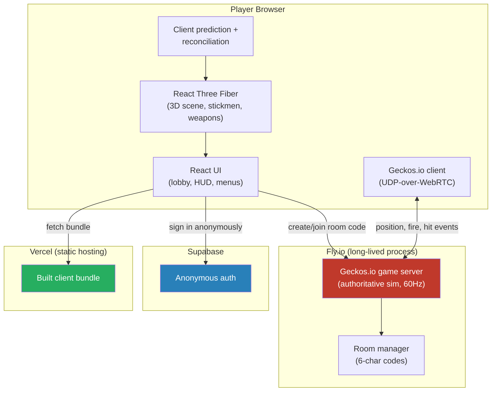
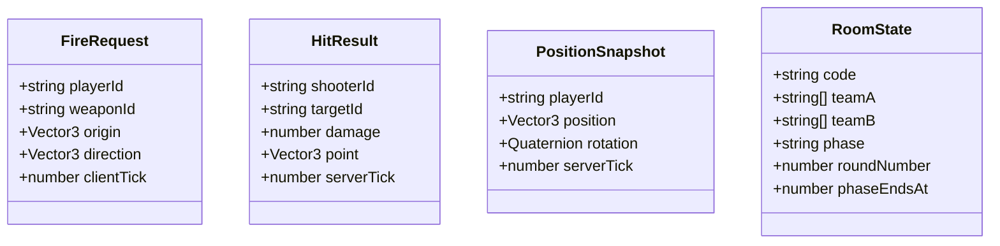
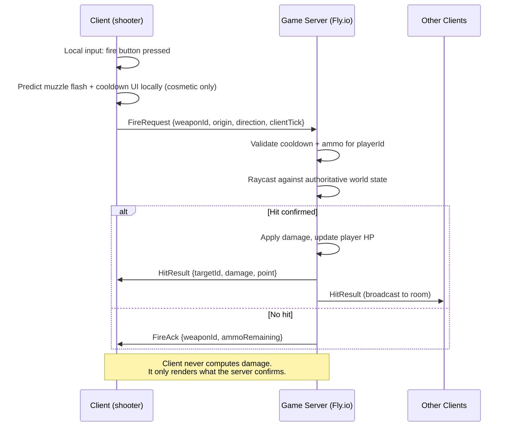
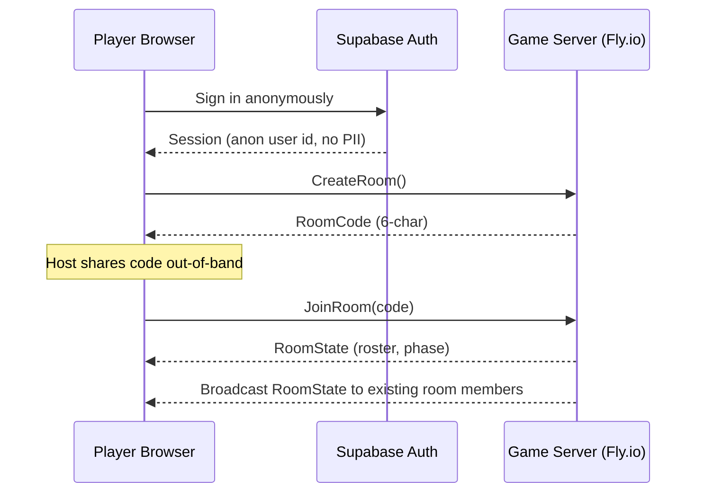
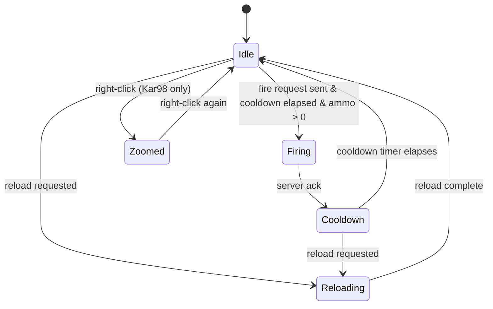
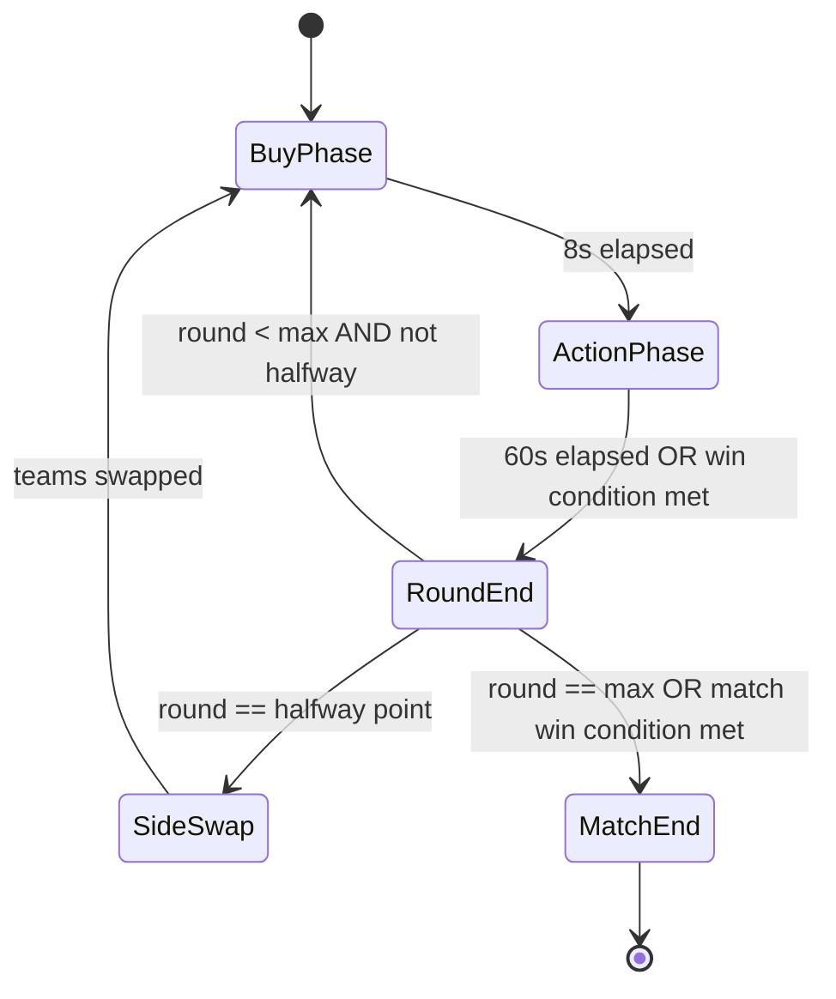
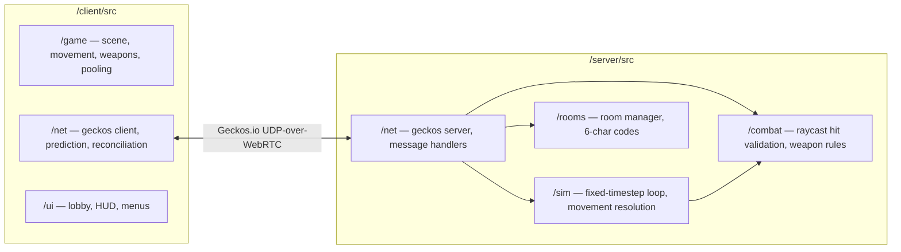

# Software Requirements Specification — Stickfps

**Version:** 0.2.0
**Status:** Living document — originally the Phase 0 deliverable, last updated 2026-07-16 (post-launch follow-up round 9)
**Conforms to:** IEEE 830-1998 structure (adapted)
**Related:** [PROJECT.md](../PROJECT.md) · [TASKS.md](../TASKS.md) · [PROGRESS.md](../PROGRESS.md)

---

## 1. Introduction

### 1.1 Purpose

This document specifies the functional and non-functional requirements for **Stickfps**, a browser-based 5v5 tactical stickman FPS. It is the authoritative reference for the architect/coder/tester build loop defined in [TASKS.md](../TASKS.md) — every per-task spec in `docs/specs/` must trace back to a requirement here.

### 1.2 Scope

Stickfps is a real-time multiplayer shooter played in a desktop browser. Two teams of five compete across rounds with a buy-phase economy. The system comprises:

- A **client** (React + Three.js/R3F) rendering the 3D scene, handling input, and predicting local movement.
- A **game server** (Node.js + Geckos.io) that is sole authority over movement resolution and hit validation.
- An **auth/matchmaking** layer (Supabase anonymous auth + room codes) with no persistent player data.

Out of scope for v1: persistent accounts/stats, matchmaking rating, voice chat, mobile input, more than two weapons.

### 1.3 Definitions

| Term | Meaning |
|---|---|
| Hitscan | Instant ray-based weapon resolution (no travel-time projectile) |
| Server-authoritative | The server computes the outcome of an action; clients render a result, never decide one |
| Reconciliation | Client corrects its predicted local state against the server's authoritative snapshot |
| Room code | 6-character alphanumeric code identifying one live match |
| Buy phase | Fixed window at round start where players spend economy on loadout (v1: implicit, no shop UI beyond weapon select — see 3.6) |
| Fixed timestep | Simulation advances in constant-size steps (1/60s) regardless of render frame rate |

### 1.4 References

- Geckos.io documentation (client-server UDP-over-WebRTC).
- Supabase Auth (anonymous sign-in) documentation.
- Fly.io / Vercel deployment documentation.

### 1.5 Overview

Section 2 describes the product at a high level with architecture diagrams. Section 3 lists functional requirements grouped by subsystem, each traceable to a TASKS.md phase. Section 4 covers external interfaces. Section 5 covers non-functional requirements. Section 6 gives data/message schemas. Section 7 maps requirements to phases for traceability.

---

## 2. Overall Description

### 2.1 Product Perspective

Stickfps is a new, self-contained system: a static frontend and a standalone realtime backend, tied together by a third-party auth provider. No legacy system integration.

### 2.2 Product Functions (Summary)

1. Anonymous sign-in and room create/join by 6-character code.
2. 5v5 team assignment and host-controlled match start.
3. First-person movement (WASD + mouse look) with jump, at a fixed 60Hz simulation rate.
4. Two hitscan weapons with distinct cooldown/ammo/zoom behavior.
5. Server-authoritative hit registration — client never determines damage.
6. Round loop: buy phase → action phase → round-end → side swap at halfway → match end.
7. Per-round economy (starting money, win/loss payout).
8. Object-pooled rendering of bullets/impact particles for 10 concurrent players.

### 2.3 User Characteristics

Players: casual-to-competitive FPS players using a desktop browser with mouse + keyboard. No account creation friction expected (anonymous auth). No assumed familiarity with the specific ruleset beyond general tactical-shooter conventions (buy phase, round-based economy).

### 2.4 Constraints

- **C1** — All movement/hit-registration authority lives server-side. The client predicts and reconciles; it never decides outcomes.
- **C2** — Client-server model only. No mesh between clients. *(Updated post-launch round 11: the transport is now plain WebSocket-over-TCP (`ws`), not geckos.io UDP-over-WebRTC — swapped so the server runs on free hosts without UDP. The client-server-only constraint is unchanged; every geckos/UDP/WebRTC reference elsewhere in this doc should be read as "the WebSocket transport".)*
- **C3** — Fixed-timestep (60Hz) game loop, decoupled from render framerate.
- **C4** — Object pooling required for bullets/particles — no per-frame allocation in hot paths.
- **C5** — Frontend on Vercel, backend on a persistent Node host (Render/Koyeb/Fly.io). Vercel serverless functions cannot hold a persistent 60Hz loop (10s timeout), so the two halves cannot share a host. *(Round 11: the WebSocket transport removed the UDP requirement, so the backend is no longer tied to Fly.io — any persistent host works, including free no-card tiers.)*
- **C6** — Zero PII collected or stored.

### 2.5 Assumptions and Dependencies

- Players have a WebSocket-capable browser (any current browser — a lower bar than the old WebRTC requirement).
- The backend host supports long-lived WebSocket connections (all persistent Node hosts do; no UDP needed since round 11).
- Supabase project is provisioned with anonymous auth enabled.

---

## 3. System Features (Functional Requirements)

Each feature lists its requirement ID, description, and the TASKS.md phase it belongs to. Acceptance criteria are finalized per-task in `docs/specs/task-<id>.md` by the architect subagent — this section defines *what*, not the mechanical test steps.

### 3.1 Scaffold & Project Setup — *Phase 1*

- **FR-1.1** — The client SHALL be a Vite + React + TypeScript project with `three`, `@react-three/fiber`, `@react-three/drei`, `geckos.io-client`, `@supabase/supabase-js` as dependencies.
- **FR-1.2** — Source SHALL be organized into `/src/game` (3D/simulation), `/src/net` (networking), `/src/ui` (menus/HUD).

### 3.2 Core 3D & Input — *Phase 2*

- **FR-2.1** — The scene SHALL render a low-poly stickman avatar (capsule torso + limb primitives) and a ground plane.
- **FR-2.2** — Pointer-lock mouse look SHALL control camera yaw/pitch.
- **FR-2.3** — WASD SHALL drive movement with velocity clamping to a maximum speed; Space SHALL trigger a jump subject to gravity.
- **FR-2.4** — The simulation SHALL advance on a fixed 60Hz timestep independent of the browser's render rate (C3).
- **FR-2.5** — Releasing pointer lock (Esc, or an explicit on-screen Pause button) SHALL open a local pause menu with Resume, a persisted mouse-sensitivity slider, and Leave Match. Pausing is client-local only — it does not stop the round for other players, since the round loop is server-authoritative (matches standard tactical-FPS Esc-menu behavior, not a single-player pause).
- **FR-2.6** — Game input (fire, zoom, reload, weapon switch, movement keys) SHALL only be acted on while pointer lock is held; with the pointer released, clicks belong to the UI (clicking a pause-menu button must not fire the weapon) and the client sends explicit neutral movement input so the player also stops server-side. *(Added post-launch, follow-up round 5.)*
- **FR-2.7** — Movement SHALL follow a Quake-projection acceleration model with air-strafe control, plus crouch (C or Left-Ctrl: eye height 1.6m → 1.0m, half walk speed) and crouch-slide (entering a crouch at ≥5 m/s grants a one-time 1.15× boost with low friction; the slide is steerable, auto-ends at 0.9s or below 2.5 m/s, and jumping out of it keeps the boost — slide-hop — hard-capped at 12 m/s). Both simulation copies (client prediction and server authority) SHALL implement the identical model. *(Added post-launch, follow-up round 6.)*

### 3.3 Weapons & Ballistics — *Phase 3*

- **FR-3.1** — A weapon state machine SHALL track equipped weapon, remaining ammo, and cooldown timer.
- **FR-3.2** — Revolver: 6 rounds, 0.5s fire cooldown, hitscan resolution.
- **FR-3.3** — Kar98: 5 rounds, 1.5s fire cooldown, hitscan resolution, right-click toggles zoom from 75° to 30° FOV.
- **FR-3.4** — The client SHALL only ever send a *fire request* (weapon id, aim direction, client tick). It SHALL NOT compute or transmit a hit result (C1).
- **FR-3.5** — The player SHALL be able to switch between carried weapons (1: Revolver, 2: Kar98) at any time; each weapon SHALL retain its own ammo/cooldown/reload state independently of which is currently equipped (mirrors the server's per-player `weapons` record).
- **FR-3.6** — Reloading SHALL be synchronized to the server via a `reload-request` message; the server owns the ammo refill (timer-gated, no up-front refill). A client-local-only reload would leave the weapon permanently empty server-side after its first magazine. *(Added post-launch, follow-up round 5 — this was a live game-breaking bug before then.)*
- **FR-3.7** — The server SHALL track which weapon each player has in hand (`switch-weapon` message) and SHALL reject fire requests for any other weapon; switching SHALL impose a settle delay (`EQUIP_SEC`, 0.35s, enforced server-side and mirrored client-side with a draw animation) so alternating switch+fire messages cannot combine both weapons' cooldowns into a higher fire rate. *(Added post-launch, follow-up round 5.)*
- **FR-3.8** — During the buy phase, players SHALL be able to open an armory UI (B key, gated to the buy phase) and purchase weapons via a server-validated `buy-request` against `WEAPON_PRICE` (Revolver: free starter; Kar98: $2400); insufficient funds SHALL be rejected server-side. Loadouts SHALL reset to the free pistol at the start of every round (CS-style — a bought weapon lasts one round). *(Added post-launch, follow-up round 6.)*
- **FR-3.9** — Weapon accuracy SHALL be computed entirely server-side (`aimError.ts`): per-weapon movement/air/crouch spread scaling and per-shot recoil climb (reset after 0.35s without firing) SHALL be applied to the ray *before* casting, so a modified client cannot no-recoil spray. A stationary, grounded first shot SHALL be exactly the aimed ray. The client's dynamic crosshair mirrors this model but is a read-out, not an authority. *(Added post-launch, follow-up round 6.)*
- **FR-3.10** — Hit validation SHALL model head/body/legs hit-zone spheres per target with damage multipliers ×2.5 / ×1.0 / ×0.85, tested head-first (a ray grazing two zones resolves in the shooter's favor). *(Added post-launch, follow-up round 6.)*

### 3.4 Networking — *Phase 4*

- **FR-4.1** — The server SHALL run a WebSocket game server (`ws`) on a persistent Node host, addressable by a 6-character room code. *(Round 11: was a Geckos.io UDP-over-WebRTC instance on Fly.io.)*
- **FR-4.2** — The server SHALL be the sole authority resolving fire-request raycasts and movement collision.
- **FR-4.3** — The server SHALL broadcast authoritative position/rotation snapshots to all clients in a room at a fixed tick rate.
- **FR-4.4** — The client SHALL apply local prediction for its own movement and reconcile against the authoritative snapshot; remote players SHALL be interpolated between received snapshots.
- **FR-4.5** — No direct client-to-client (WebRTC mesh) connection SHALL exist (C2).
- **FR-4.6** — The server SHALL reject fire requests from dead players (who are also excluded as raycast targets), outside the action phase (no lobby or buy-phase kills), for non-equipped weapons, and during the equip settle delay; teammates SHALL be excluded from hit candidates (friendly fire off for v1 — shots pass through). Joining or creating a room while already in one SHALL remove the player from the previous room first (no zombie players holding rooms and their 60Hz loops alive). *(Added post-launch, follow-up round 5.)*

### 3.5 Auth & Lobby — *Phase 5*

- **FR-5.1** — On load, the client SHALL sign the player in anonymously via Supabase.
- **FR-5.2** — "Create Room" SHALL generate a 6-character code and provision/join a match on the Fly.io server.
- **FR-5.3** — "Join Room" SHALL accept a 6-character code and connect to the corresponding match.
- **FR-5.4** — The lobby SHALL display a roster (up to 5 per team) and restrict match start to the host. 5v5 is the capacity ceiling, not a minimum — the host MAY start a match with any team sizes present (1v1 through 5v5, including uneven teams), since there's no dedicated matchmaking queue waiting to fill a room.
- **FR-5.5** — Each player SHALL be auto-assigned a unique, human-readable display name (drawn from a color-word palette) on joining a room, scoped to that room — no manual name entry.

### 3.6 Game Loop Logic — *Phase 6*

- **FR-6.1** — A match SHALL run up to 12 rounds, each with an 8s buy phase followed by a 60s action phase. *(Retuned post-launch, follow-up round 9, for pace — originally 30s/90s.)*
- **FR-6.2** — Teams SHALL swap sides at the halfway round.
- **FR-6.3** — Player positions SHALL reset at the start of each round.
- **FR-6.4** — Economy SHALL start each player at $800 and award +$3000 to the winning team on round completion (value pending ruleset confirmation, see [TASKS.md](../TASKS.md) 6.1).
- **FR-6.5** — The server SHALL tally round wins per team (`teamWins`, swapped with the players at the side swap), hold a 3s round-end intermission between a decided round and the next buy phase (so the death screen and "who won the round" moment are actually visible), end the match early once a team clinches a majority of all rounds, and broadcast the tally + last round winner in every RoomState. The client SHALL show a team-score line, a round-end banner, and a match-end VICTORY/DEFEAT/DRAW screen. *(Added post-launch, follow-up round 5 — before this, nothing tracked round wins and a match winner was undeterminable.)*
- **FR-6.6** — Movement SHALL be clamped to the arena bounds (±24m on X/Z, `ARENA_HALF_EXTENT`) identically in both simulation copies, with matching visual perimeter walls. *(Added post-launch, follow-up round 5.)*
- **FR-6.7** — Dead players SHALL be frozen (input ignored) and unable to fire until the next round resets them; the eliminated player's client SHALL show a death overlay for the rest of the round. *(Added post-launch, follow-up round 5.)*

### 3.7 Performance & Hardening — *Phase 7*

- **FR-7.1** — Bullets and impact particles SHALL be drawn from an object pool; steady-state gameplay SHALL NOT allocate new objects per frame in the render/simulation hot path.
- **FR-7.2** — LOD SHALL be applied to stickman models if frame rate drops are observed with 10 concurrent players.
- **FR-7.3** — A security audit SHALL confirm no client-side code path can determine or spoof a hit/damage/movement outcome (C1 enforcement check).

### 3.8 Deployment — *Phase 8*

- **FR-8.1** — The client SHALL deploy to Vercel with `VITE_SUPABASE_URL` / `VITE_SUPABASE_ANON_KEY` configured.
- **FR-8.2** — The server SHALL deploy to a persistent Node host (Render/Koyeb/Fly.io) exposing its HTTP/WebSocket port. *(Round 11: no UDP port needed anymore — the WebSocket transport shares the single HTTP port.)*
- **FR-8.3** — The server SHALL restrict CORS to the deployed Vercel origin.

### 3.9 Environment & Visual Presentation — *Post-launch follow-up*

- **FR-9.1** — The arena SHALL be dressed with an industrial ("Diesel Ops") prop set — cover clusters (crates, barrels, shipping containers, sandbags), perimeter catwalk/truss towers, and pipe runs — framing the existing Team A/B spawn lane (z=+10/-10).
- **FR-9.2** — At least one ambient object SHALL move continuously without player input (rotating fan, swinging crane, patrolling drone, pulsing warning beacons all present) to make the arena read as a living space rather than a static diorama.
- **FR-9.3** — ~~The client SHALL render in a monochrome ("noir") visual style (grayscale post-filter…).~~ **SUPERSEDED by FR-9.9 (2026-07-24): the client renders in full colour** (the grayscale post-filter was retired at the user's direction). Fog for depth and the key/hemisphere lighting for readable midtones/shadows are retained; hue now carries meaning (team colours, per-map palette).
- **FR-9.4 (known limitation)** — Environment props are visual/atmospheric only this round: they do not participate in movement collision or bullet raycasting, both of which are server-authoritative and only model players (see [server/src/rooms/Room.ts](../server/src/rooms/Room.ts), [server/src/sim/movement.ts](../server/src/sim/movement.ts)). Making them functional cover would require adding matching static-geometry collision server-side (so client prediction and server reconciliation agree) — tracked as a follow-up, not attempted here to avoid shipping cover that looks solid but isn't. (Exception: the arena boundary itself is real — FR-6.6.)
- **FR-9.5** — Combat SHALL have a feedback layer: HP bar, damage-flash vignette on being hit, hitmarker (visual + audio blip) on landing a hit, kill feed with display names, buy-phase and round-end banners, and a pulsing reload hint at empty magazine. All sound effects SHALL be synthesized via Web Audio (no audio asset pipeline): per-weapon gunshots (distance-attenuated for remote shooters), dry fire, reload clicks, damage thud. *(Added post-launch, follow-up round 5.)*
- **FR-9.6** — Remote player avatars SHALL animate: a procedural walk cycle driven by measured horizontal speed, a death topple while eliminated, and a floating overhead marker on teammates (the friend/foe signal in a grayscale scene). Disconnected players SHALL disappear rather than freeze in place (interpolation buffers go stale after 1s and are pruned on roster changes). The first-person viewmodel SHALL play a draw-raise on weapon switch, a walk bob, and a muzzle flash per shot. *(Added post-launch, follow-up round 5.)*
- **FR-9.7** — Remote player avatars SHALL hold a visible gun prop matching their server-side equipped weapon (broadcast in RoomState, including on `switch-weapon`), posed appropriately (revolver one-handed aim, kar98 two-handed), with a spring arm-recoil kick and a brief muzzle flash per server-confirmed shot (driven by a per-shooter fire counter, edge-triggered with a null baseline so a mid-match join does not replay a stale shot). *(Added post-launch, follow-up round 9.)*
- **FR-9.8** — The arena SHALL carry a second environment dressing pass (container stacks, rubble piles, lamp posts with real point-light pools, animated steam vents, sagging cable spans with hanging work lamps, painted lane markings, and a beyond-the-walls skyline of smokestacks and a gantry frame) with lighting values balanced for readability. *(Added post-launch, follow-up round 9; originally authored for luminance separation under the grayscale filter — that filter was retired in round 10, see FR-9.9.)*
- **FR-9.9** — The client SHALL render the 3D match view in **full colour** (a `contrast/saturate/brightness` grade replacing the retired `grayscale(1)` filter) and SHALL make friend/foe legible by colour — teammates rendered blue, enemies red-orange (`client/src/game/teamColors.ts`), matched by the HUD score/scoreboard. A bloom post pass (`client/src/game/effects/PostFX.tsx`) SHALL glow bright emissives. *(Post-launch, follow-up round 10.)*
- **FR-9.10** — The server SHALL support **AI bots**: a host MAY, from the lobby only, fill empty slots with bots (`add-bots` wire event → `Room.fillWithBots`, host + waiting-phase enforced server-side). Bots SHALL be authoritative `PlayerRecord`s driven through the same fire/move/reload paths as humans, SHALL never become host, and SHALL be removed once no humans remain. *(Post-launch, follow-up round 10.)*
- **FR-9.11** — Each player SHALL have a **frag-grenade ability** ([G]). The throw request carries only camera origin + aim; the server SHALL own the projectile arc (gravity + floor/wall bounces), the fuse (1.6s), radial detonation damage (falloff 92→16 over a 6.5m blast, friendly-fire off), and a per-player cooldown (16s, reset each round). The server SHALL broadcast live grenade positions (`grenade-state`) and detonations (`grenade-exploded`); detonation damage SHALL reuse the existing `hit-result` path. The client cooldown is a mirror only (server-enforced). *(Post-launch, follow-up round 10.)*
- **FR-9.12** — The server SHALL grant **killstreak perks**: a 3-kill streak → tier I, 5 → tier II (reset on death or new round), buffing fire cooldown (×0.88/×0.78), reload (×0.85/×0.72), and move speed (×1.05/×1.10). Because the client predicts these, the buff tables SHALL be mirrored client+server (`combat/perks.ts` ↔ `game/perks.ts`) and the affected pure sim functions SHALL take a multiplier so prediction and reconciliation agree. The current tier SHALL ride in `RoomPlayerSummary.perkTier`. *(Post-launch, follow-up round 10.)*
- **FR-9.13** — The server SHALL select and broadcast a **cosmetic map id** (`RoomState.mapId`); the client SHALL render the matching theme (palette/lighting/fog + hero prop, `client/src/game/maps.ts`: FOUNDRY-7, COLDLINE-9). A host MAY cycle the map in the lobby (`cycle-map`, host + waiting-phase enforced). Maps SHALL NOT affect the simulation (movement/hit detection know only the ±24m bounds). *(Post-launch, follow-up round 10.)*
- **FR-9.14** — The HUD SHALL provide a kill-feedback ("juice") layer — kill banner, floating damage numbers, killstreak call-outs, low-HP screen pulse — and a hold-Tab **K/D scoreboard** (both rosters, sorted by kills, crew names). `RoomPlayerSummary` SHALL carry per-player `kills`/`deaths` (reset on match start). *(Post-launch, follow-up round 10.)*

---

## 4. External Interface Requirements

### 4.1 User Interfaces

- **Lobby screen**: create/join room, roster display, host-only start control.
- **HUD**: ammo count, weapon id, round timer, economy balance, team scores.
- **Pointer-lock capture**: click-to-play overlay before pointer lock engages (browser requirement).

### 4.2 Hardware Interfaces

Mouse + keyboard only for v1 (no gamepad/touch).

### 4.3 Software Interfaces

- **Supabase JS client** — anonymous auth session.
- **Geckos.io client/server** — UDP-over-WebRTC channel; see [4.4](#44-communications-interfaces) for message shapes.
- **Three.js / R3F / drei** — rendering.

### 4.4 Communications Interfaces

See [Section 6](#6-data--message-schemas) for exact wire message shapes. Transport is Geckos.io's unreliable-by-default channel for high-frequency, self-superseding state (position/input snapshots — a dropped one is harmless since the next tick's snapshot supersedes it). Fire requests and room/lobby lifecycle events use the reliable channel: they are discrete, low-frequency, and a dropped fire request would silently eat a player's shot.

---

## 5. Non-Functional Requirements

| ID | Requirement |
|---|---|
| NFR-1 | Simulation runs a fixed 60Hz tick server-side regardless of client render rate (C3). |
| NFR-2 | Client-perceived input latency SHALL be masked by client-side prediction; corrections SHALL be smoothed, not snapped, when under normal jitter (<150ms RTT). |
| NFR-3 | No per-frame heap allocation in the bullet/particle hot path (C4) — verified via browser performance profiling in Phase 7. |
| NFR-4 | No PII is collected, stored, or logged anywhere in the system (C6). |
| NFR-5 | All authoritative game-state decisions (movement resolution, damage) execute server-side only; this is independently verified by the tester subagent for every relevant task (C1). |
| NFR-6 | Supports 10 concurrent players (5v5) in one room without server tick degradation. |

---

## 6. Data / Message Schemas

Canonical shapes are defined in code (`/server/src/net/messages.ts`, shared with the client via a workspace-relative import or generated types) — the shapes below are the SRS-level contract; the architect spec for each Phase 4/5/6 task pins the exact TypeScript interface.

### 6.1 Sequence — Fire Request / Server-Authoritative Hit Validation

### 6.2 Sequence — Room Create / Join

### 6.3 State — Weapon State Machine

### 6.4 State — Round / Match Loop

### 6.5 Component / Module View

---

## 7. Requirements Traceability

| Phase (TASKS.md) | Requirements covered |
|---|---|
| 0 — Spec | This document + PROJECT.md |
| 1 — Scaffold | FR-1.1, FR-1.2 |
| 2 — Core 3D & Input | FR-2.1 – FR-2.5, NFR-1 |
| 3 — Weapons & Ballistics | FR-3.1 – FR-3.5 |
| 4 — Networking | FR-4.1 – FR-4.5, NFR-2, NFR-6 |
| 5 — Auth & Lobby | FR-5.1 – FR-5.5, NFR-4 |
| 6 — Game Loop Logic | FR-6.1 – FR-6.4 |
| 7 — Perf & Hardening | FR-7.1 – FR-7.3, NFR-3, NFR-5 |
| 8 — Deploy | FR-8.1 – FR-8.3 |
| 9 — Environment & Presentation (follow-up) | FR-9.1 – FR-9.4 |
| 10 — Hardening & combat polish (follow-up round 5) | FR-2.6, FR-3.6, FR-3.7, FR-4.6, FR-6.5 – FR-6.7, FR-9.5, FR-9.6 |
| 11 — Post-launch rounds 6–9 (gameplay/feel expansion, animation, fast-pace redesign) | FR-2.7, FR-3.8 – FR-3.10, FR-6.1 (retune), FR-9.7, FR-9.8 |

---

## 8. Open Items

- Economy figures ($800 start / +$3000 win) are provisional — confirm against final ruleset before Phase 6 is locked (carried from TASKS.md 6.1).
- Anti-cheat beyond server-authority (e.g. rate-limiting fire requests, sanity-bounding movement deltas) is not yet specified — recommend adding as a Phase 7 follow-up.
- Reconnect-on-disconnect behavior mid-match is not yet specified.

This SRS is a living document — update it (and its traceability table) whenever a phase's scope changes, not just at project start.
